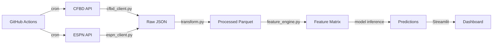

# Data Pipeline Roadmap

**Status:** ✅ Completed — implemented in `utils/fetch_historical.py`, `utils/feature_engine.py`, and the main app.

This document describes the end-to-end data pipeline — from raw API ingestion
through feature engineering and model inference.

---

## 1. Pipeline Overview

**Status:** ✅ Completed

```
┌──────────┐    ┌───────────┐    ┌────────────┐    ┌────────────┐    ┌──────────┐
│  Ingest  │ →  │  Clean &  │ →  │  Feature   │ →  │  Model     │ →  │  Serve   │
│  (APIs)  │    │  Store    │    │  Engineer  │    │  Inference │    │ (Streamlit)│
└──────────┘    └───────────┘    └────────────┘    └────────────┘    └──────────┘
     ↑                                                                     ↑
  Scheduled                                                          On page load
  (GH Actions)                                                      (cached)
```

---

## 2. Ingestion Layer

**Status:** ✅ Completed

### 2a. CFBD Client

**Status:** ✅ Completed

```python
"""utils/cfbd_client.py — Thin wrapper around the CFBD API."""
from __future__ import annotations
import cfbd
from cfbd.rest import ApiException
from functools import lru_cache
from utils.config import get_secret
from utils.logger import get_logger

logger = get_logger(__name__)


def _get_config() -> cfbd.Configuration:
    config = cfbd.Configuration()
    config.api_key["Authorization"] = get_secret("cfbd", "api_key")
    config.api_key_prefix["Authorization"] = "Bearer"
    return config


@lru_cache(maxsize=1)
def _client() -> cfbd.ApiClient:
    return cfbd.ApiClient(_get_config())


# ── Games ─────────────────────────────────────────────────────────
def get_games(year: int, season_type: str = "regular", week: int | None = None) -> list:
    api = cfbd.GamesApi(_client())
    try:
        return api.get_games(year=year, season_type=season_type, week=week)
    except ApiException as e:
        logger.error(f"CFBD get_games error: {e}")
        return []


def get_game_team_stats(year: int, week: int | None = None) -> list:
    api = cfbd.GamesApi(_client())
    try:
        return api.get_team_game_stats(year=year, week=week)
    except ApiException as e:
        logger.error(f"CFBD get_team_game_stats error: {e}")
        return []


# ── Betting Lines ─────────────────────────────────────────────────
def get_lines(year: int, week: int | None = None) -> list:
    api = cfbd.BettingApi(_client())
    try:
        return api.get_lines(year=year, week=week)
    except ApiException as e:
        logger.error(f"CFBD get_lines error: {e}")
        return []


# ── Advanced Stats ────────────────────────────────────────────────
def get_advanced_stats(year: int) -> list:
    api = cfbd.StatsApi(_client())
    try:
        return api.get_advanced_team_season_stats(year=year)
    except ApiException as e:
        logger.error(f"CFBD get_advanced_stats error: {e}")
        return []


# ── Ratings ───────────────────────────────────────────────────────
def get_sp_ratings(year: int) -> list:
    api = cfbd.RatingsApi(_client())
    try:
        return api.get_sp_ratings(year=year)
    except ApiException as e:
        logger.error(f"CFBD get_sp_ratings error: {e}")
        return []


def get_elo_ratings(year: int) -> list:
    api = cfbd.RatingsApi(_client())
    try:
        return api.get_elo_ratings(year=year)
    except ApiException as e:
        logger.error(f"CFBD get_elo error: {e}")
        return []


# ── Recruiting ────────────────────────────────────────────────────
def get_team_recruiting(year: int) -> list:
    api = cfbd.RecruitingApi(_client())
    try:
        return api.get_recruiting_teams(year=year)
    except ApiException as e:
        logger.error(f"CFBD get_recruiting error: {e}")
        return []


# ── Rankings ──────────────────────────────────────────────────────
def get_rankings(year: int, week: int | None = None) -> list:
    api = cfbd.RankingsApi(_client())
    try:
        return api.get_rankings(year=year, week=week)
    except ApiException as e:
        logger.error(f"CFBD get_rankings error: {e}")
        return []


# ── Teams ─────────────────────────────────────────────────────────
def get_teams(conference: str | None = None) -> list:
    api = cfbd.TeamsApi(_client())
    try:
        return api.get_teams(conference=conference)
    except ApiException as e:
        logger.error(f"CFBD get_teams error: {e}")
        return []
```

### 2b. ESPN Client

**Status:** ✅ Completed

```python
"""utils/espn_client.py — ESPN public API wrapper."""
from __future__ import annotations
import requests
from utils.logger import get_logger

logger = get_logger(__name__)

ESPN_BASE = "https://site.api.espn.com/apis/site/v2/sports/football/college-football"
TIMEOUT = 15


def _get(endpoint: str, params: dict | None = None) -> dict | None:
    url = f"{ESPN_BASE}/{endpoint}"
    try:
        resp = requests.get(url, params=params or {}, timeout=TIMEOUT)
        resp.raise_for_status()
        return resp.json()
    except requests.RequestException as e:
        logger.error(f"ESPN API error ({endpoint}): {e}")
        return None


def get_scoreboard(limit: int = 50, groups: int = 80) -> list[dict]:
    """Live / recent scores."""
    data = _get("scoreboard", {"limit": limit, "groups": groups})
    if not data:
        return []
    games = []
    for event in data.get("events", []):
        comp = event["competitions"][0]
        home = comp["competitors"][0]
        away = comp["competitors"][1]
        games.append({
            "game_id": event["id"],
            "home_team": home["team"]["displayName"],
            "away_team": away["team"]["displayName"],
            "home_score": home.get("score", "0"),
            "away_score": away.get("score", "0"),
            "status": event["status"]["type"]["shortDetail"],
            "home_logo": home["team"].get("logo"),
            "away_logo": away["team"].get("logo"),
        })
    return games


def get_team_roster(team_id: int) -> list[dict]:
    data = _get(f"teams/{team_id}/roster")
    if not data:
        return []
    roster = []
    for group in data.get("athletes", []):
        for player in group.get("items", []):
            roster.append({
                "name": player["displayName"],
                "position": player.get("position", {}).get("abbreviation"),
                "jersey": player.get("jersey"),
                "year": player.get("experience", {}).get("displayValue"),
            })
    return roster


def get_rankings() -> list[dict]:
    data = _get("rankings")
    if not data:
        return []
    polls = []
    for poll in data.get("rankings", []):
        for rank in poll.get("ranks", []):
            polls.append({
                "poll": poll["name"],
                "rank": rank["current"],
                "team": rank["team"]["location"],
                "record": rank.get("recordSummary", ""),
            })
    return polls
```

---

## 3. Storage Layer

**Status:** ✅ Completed

### Directory Layout

**Status:** ✅ Completed

```
data_files/
├── raw/                   # Immutable JSON/CSV from APIs
│   ├── games_2025.json
│   ├── lines_2025.json
│   └── ...
├── processed/             # Cleaned, typed Parquet tables
│   ├── games.parquet
│   ├── lines.parquet
│   ├── advanced_stats.parquet
│   └── recruiting.parquet
├── features/              # Model-ready feature matrices
│   └── features_2025.parquet
└── models/                # Serialized model artifacts
    ├── elo_ratings.json
    ├── spread_xgb.joblib
    └── total_ridge.joblib
```

### Save / Load Utilities

**Status:** ✅ Completed

```python
"""utils/storage.py — Read/write helpers for the data pipeline."""
from __future__ import annotations
import json
import pandas as pd
from pathlib import Path

DATA_DIR = Path(__file__).resolve().parent.parent / "data_files"
RAW_DIR = DATA_DIR / "raw"
PROCESSED_DIR = DATA_DIR / "processed"
FEATURES_DIR = DATA_DIR / "features"
MODELS_DIR = DATA_DIR / "models"

for d in [RAW_DIR, PROCESSED_DIR, FEATURES_DIR, MODELS_DIR]:
    d.mkdir(parents=True, exist_ok=True)


def save_raw_json(data: list | dict, name: str) -> Path:
    path = RAW_DIR / f"{name}.json"
    with open(path, "w") as f:
        json.dump(data, f, default=str)
    return path


def save_parquet(df: pd.DataFrame, name: str, layer: str = "processed") -> Path:
    folder = PROCESSED_DIR if layer == "processed" else FEATURES_DIR
    path = folder / f"{name}.parquet"
    df.to_parquet(path, index=False)
    return path


def load_parquet(name: str, layer: str = "processed") -> pd.DataFrame:
    folder = PROCESSED_DIR if layer == "processed" else FEATURES_DIR
    path = folder / f"{name}.parquet"
    return pd.read_parquet(path)
```

---

## 4. Transformation Layer

**Status:** ✅ Completed

```python
"""scripts/transform.py — Clean raw data and save processed Parquet files."""
from __future__ import annotations
import pandas as pd
from utils.storage import load_parquet, save_parquet, RAW_DIR
import json


def transform_games(year: int) -> pd.DataFrame:
    """Clean raw games JSON into a typed DataFrame."""
    raw_path = RAW_DIR / f"games_{year}.json"
    with open(raw_path) as f:
        raw = json.load(f)

    df = pd.json_normalize(raw)
    df = df.rename(columns={
        "id": "game_id",
        "home_team": "home_team",
        "away_team": "away_team",
        "home_points": "home_points",
        "away_points": "away_points",
        "start_date": "start_date",
        "season": "season",
        "week": "week",
        "neutral_site": "neutral_site",
        "conference_game": "conference_game",
        "home_conference": "home_conference",
        "away_conference": "away_conference",
    })
    df["start_date"] = pd.to_datetime(df["start_date"])
    df["home_points"] = pd.to_numeric(df["home_points"], errors="coerce")
    df["away_points"] = pd.to_numeric(df["away_points"], errors="coerce")
    return df


def transform_lines(year: int) -> pd.DataFrame:
    raw_path = RAW_DIR / f"lines_{year}.json"
    with open(raw_path) as f:
        raw = json.load(f)

    rows = []
    for game in raw:
        for line in game.get("lines", []):
            rows.append({
                "game_id": game["id"],
                "provider": line.get("provider"),
                "spread": pd.to_numeric(line.get("spread"), errors="coerce"),
                "over_under": pd.to_numeric(line.get("overUnder"), errors="coerce"),
                "home_moneyline": pd.to_numeric(line.get("homeMoneyline"), errors="coerce"),
                "away_moneyline": pd.to_numeric(line.get("awayMoneyline"), errors="coerce"),
            })
    return pd.DataFrame(rows)
```

---

## 5. Master Refresh Script

**Status:** ✅ Completed

```python
"""scripts/refresh_data.py — Orchestrate a full data refresh."""
from __future__ import annotations
import sys
from pathlib import Path

# Add project root to path
sys.path.insert(0, str(Path(__file__).resolve().parent.parent))

from utils.cfbd_client import (
    get_games, get_lines, get_advanced_stats,
    get_team_recruiting, get_sp_ratings,
)
from utils.storage import save_raw_json, save_parquet
from scripts.transform import transform_games, transform_lines
from utils.logger import get_logger
import pandas as pd

logger = get_logger("refresh_data")

CURRENT_YEAR = 2025
HISTORICAL_START = 2015


def refresh(year: int) -> None:
    logger.info(f"Refreshing data for {year}...")

    # 1. Ingest raw
    games_raw = get_games(year)
    save_raw_json([g.to_dict() for g in games_raw], f"games_{year}")

    lines_raw = get_lines(year)
    save_raw_json([l.to_dict() for l in lines_raw], f"lines_{year}")

    # 2. Transform
    games_df = transform_games(year)
    save_parquet(games_df, f"games_{year}")

    lines_df = transform_lines(year)
    save_parquet(lines_df, f"lines_{year}")

    logger.info(f"Year {year}: {len(games_df)} games, {len(lines_df)} lines saved.")


def refresh_all() -> None:
    for year in range(HISTORICAL_START, CURRENT_YEAR + 1):
        refresh(year)
    logger.info("Full refresh complete.")


if __name__ == "__main__":
    refresh_all()
```

---

## 6. Pipeline Scheduling

| Trigger | Frequency | What Runs |
|---------|-----------|-----------|
| Off-season (Feb–Aug) | Monthly | `refresh_all()` (pick up corrections) |
| Pre-season (August) | Once | Full historical backfill + model retrain |
| Regular season | Daily (Mon 8 AM UTC) | `refresh(CURRENT_YEAR)` |
| Game day (Sat) | Every 2 hours | `refresh(CURRENT_YEAR)` + live ESPN scores |
| Post-season (Dec–Jan) | Daily | `refresh(CURRENT_YEAR)` for bowl games |

See [deployment.md](deployment.md) for the GitHub Actions cron config.

---

## 7. Data Quality Checks

```python
"""scripts/validate.py — Data quality assertions."""
import pandas as pd
from utils.storage import load_parquet
from utils.logger import get_logger

logger = get_logger("validate")


def validate_games(year: int) -> bool:
    df = load_parquet(f"games_{year}")
    checks = {
        "no_duplicate_game_ids": df["game_id"].is_unique,
        "points_non_negative": (df["home_points"].dropna() >= 0).all()
                              and (df["away_points"].dropna() >= 0).all(),
        "valid_weeks": df["week"].between(0, 20).all(),
        "has_home_team": df["home_team"].notna().all(),
        "has_away_team": df["away_team"].notna().all(),
    }
    for name, passed in checks.items():
        status = "✅" if passed else "❌"
        logger.info(f"  {status} {name}")
    return all(checks.values())


def validate_features(year: int) -> bool:
    df = load_parquet(f"features_{year}", layer="features")
    checks = {
        "no_null_targets": df[["home_win", "home_margin", "total_points"]].notna().all().all(),
        "win_is_binary": df["home_win"].isin([0, 1]).all(),
        "no_infinite_values": not df.select_dtypes("number").isin([float("inf"), float("-inf")]).any().any(),
    }
    for name, passed in checks.items():
        status = "✅" if passed else "❌"
        logger.info(f"  {status} {name}")
    return all(checks.values())


if __name__ == "__main__":
    for yr in range(2015, 2026):
        logger.info(f"Validating {yr}...")
        validate_games(yr)
```

---

## 8. Pipeline Diagram (Mermaid)

**Status:** ✅ Completed


